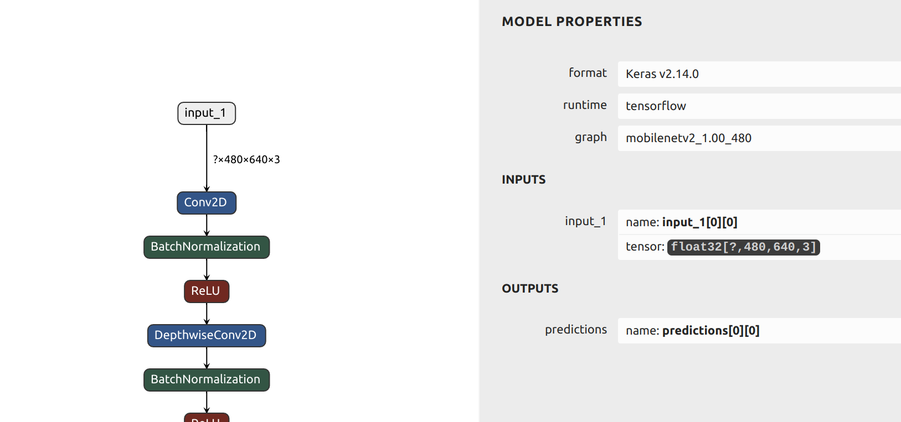

# Running ModelSDK on a TensorFlow2 Keras classifier model #

How to quantize and compile a simple Keras classifier model using Palette 1.6. 

This tutorial shows how to run default Post-Training Quantization (PTQ), evaluate the quantized model and then compiling for the output .tar.gz archive.


## Before starting ##

### The Keras model ###

The Keras model is trained on the MNIST dataset but with images that have been scaled up to 640(W)x480(H) and modified to have a black text on a white background.

The Keras model must:

* Be completely floating-point 32bit
* Have static input dimensions
* Have a batch dimension of None or 1 (the implemented batch size can be set during the compile phase)


To check this, use the [Netron](https://netron.app/) tool:





We see in Netron that the input (called 'input_1') has a shape of ?,480,640,3. The '?' symbol indicates that batch size is not specified, this is common for Keras models.


Note down the name of the input and its shape - you will need it later. It also useful to know the order of the model input dimensions - in this case, the order is NHWC (N=batch, H=Height, W=Width, C=channels)


### Pre and post-processing ###

You must know what pre- and post-processing was applied during the training of the floating-point model. For this model the pre-processing was division by 255 to bring all pixels into the range 0 to 1.

The post-processing is just simply an argmax function to find the class with the highest probability.


### Calibration data ###

We need a small number of samples from the training dataset to use during the quantization process. These should be randomly chosed from the training dataset. 


### Test data and labels ###

If we want to test the results of quantization and compare it to the original floating-point model (highly recommended!) then we will need some test data and ground truth labels.


## Test the floating-point Keras model ##

An optional step is to run inference of the original Keras model and check the output to ensure that it is functional and to create a baseline reference. TensorFlow2 is included in the SDK docker, so we can run the floating-point model. The run_keras.py script includes pre- and postprocessing. 

Start the Palette docker container - just reply with './' when asked for the work directory:

```shell
./start.py
```

The output in the console will look like this:

```shell
user@ubmsh:~/tutorials/modelsdk_keras$ ./start.py 
Set no_proxy to localhost,127.0.0.0
Using port 49152 for the installation.
Checking if the container is already running...
Enter work directory [/home/user/tutorials/modelsdk_keras]: ./
Starting the container: palettesdk_1_6_0_Palette_SDK_master_B163
Checking SiMa SDK Bridge Network...
SiMa SDK Bridge Network found.
Creating and starting the Docker container...
b376b867257233623491103715372c56d56d0403ca3c0da4d68a3cde2c7c6a27
Successfully copied 3.07kB to /home/user/tutorials/modelsdk_keras/passwd.txt
Successfully copied 3.07kB to palettesdk_1_6_0_Palette_SDK_master_B163:/etc/passwd
Successfully copied 2.56kB to /home/user/tutorials/modelsdk_keras/shadow.txt
Successfully copied 2.56kB to palettesdk_1_6_0_Palette_SDK_master_B163:/etc/shadow
Successfully copied 2.56kB to /home/user/tutorials/modelsdk_keras/group.txt
Successfully copied 2.56kB to palettesdk_1_6_0_Palette_SDK_master_B163:/etc/group
Successfully copied 3.58kB to /home/user/tutorials/modelsdk_keras/sudoers.txt
Successfully copied 3.58kB to palettesdk_1_6_0_Palette_SDK_master_B163:/etc/sudoers
Successfully copied 2.05kB to palettesdk_1_6_0_Palette_SDK_master_B163:/home/docker/.simaai/.port
user@b376b8672572:/home$ 
```

Then navigate into the working directory:

```shell
user@b376b8672572:/home$ cd docker/sima-cli
```

Now execute the script that runs the floating-point Keras model: 

```shell
user@b376b8672572:/home/docker/sima-cli$ python run_keras.py
```


The output predictions are listed and a final accuracy scores is given:

```shell
--------------------------------------------------
TensorFlow version :  2.10.0
3.10.12 (main, Mar 31 2025, 18:12:36) [GCC 11.4.0]
--------------------------------------------------
Loaded model from keras/mnist_640_480.h5
Input Name: input_1  Shape: (None, 480, 640, 3) Data type: <dtype: 'float32'>
Output Name: predictions/BiasAdd:0  Shape: (None, 10) Data type: <dtype: 'float32'>
Found 10 images in test_data
8 img_10.png
0 img_11.png
7 img_12.png
9 img_13.png
8 img_14.png
4 img_15.png
5 img_16.png
3 img_17.png
4 img_18.png
0 img_19.png
Accuracy: 100.00%
```


## Quantize & Compile ##

The run_modelsdk.py script will do the following:

* Interrogate the Keras model to get input names & shapes.
* load the floating-point Keras model.
* quantize using pre-processed calibration data and default quantization parameters.
* test the quantized model accuracy using pre-processed images. An accuracy value is generated and should be compared to the value obtained from the floating-point model.
* compile to generate a tar.gz

```shell
python run_modelsdk.py
```

If this runs correctly, the final output messages in the console will be like this:

```shell
2025-04-21 05:03:41,874 - afe.backends.mpk.interface - INFO - ==============================
2025-04-21 05:03:41,874 - afe.backends.mpk.interface - INFO - Compilation summary:
2025-04-21 05:03:41,874 - afe.backends.mpk.interface - INFO - ------------------------------
2025-04-21 05:03:41,874 - afe.backends.mpk.interface - INFO - Desired batch size: 1
2025-04-21 05:03:41,874 - afe.backends.mpk.interface - INFO - Achieved batch size: 1
2025-04-21 05:03:41,874 - afe.backends.mpk.interface - INFO - ------------------------------
2025-04-21 05:03:41,875 - afe.backends.mpk.interface - INFO - Plugin distribution per backend:
2025-04-21 05:03:41,875 - afe.backends.mpk.interface - INFO -   MLA : 1
2025-04-21 05:03:41,875 - afe.backends.mpk.interface - INFO -   EV74: 5
2025-04-21 05:03:41,875 - afe.backends.mpk.interface - INFO -   A65 : 0
2025-04-21 05:03:41,875 - afe.backends.mpk.interface - INFO - ------------------------------
2025-04-21 05:03:41,875 - afe.backends.mpk.interface - INFO - Generated files: mnist_640_480_stage1_mla_stats.yaml, mla.json, mnist_640_480_stage1_mla.elf, preproc.json, mnist_640_480_mpk.json, detess_dequant.json
Compiled model written to build/mnist_640_480
```

The compiled model is written to build/mnist_640_480/mnist_640_480_mpk.tar.gz.


### Code Walkthrough ###

The Keras model is loaded and interrogated to return a list of input names and shapes. The input names and their shapes are needed as parameters when we load the model into the SiMa 'LoadedNet' format. First we the input shapes dictionary. Each key, value pair in the input shapes dictionary is an input name (string) and an 4-dimensional shape (tuple).

```python
model = tf.keras.models.load_model(args.model,compile=False)
input_shape_dict={}
input_names_list=[]
for inp in model.inputs:
  print('Input Name:',inp.name, ' Shape:',inp.shape, 'Data type:',inp.dtype)
  input_shape_dict[inp.name]=(1,*inp.shape[1:])
  input_names_list.append(inp.name)
```

The input names and their shapes are needed as parameters when we load the model into the SiMa 'LoadedNet' format. First we the input shapes dictionary. Each key, value pair in the input shapes dictionary is an input name (string) and an 4-dimensional shape (tuple).


We then set up the importer parameters and load the floating-point Keras model:

```python
params: ImporterParams = keras_source(model_path=args.model,
                                      shape_dict=input_shape_dict,
                                      layout="NHWC")

loaded_net = load_model(params)
print(f'Loaded model from {args.model}')
```


The calibration images are read from the appropriate folder and then preprocessed before being appended to an iterable variable (a list in the case). Each calibration sample is provided as a dictionary, the key is the name of the input that will have the preprocessed calibration sample applied to it, the value is the preprocessed sample:


```python
calibration_data=[]
# make a list of calibration images
calib_images = [f for f in os.listdir(args.calib_data) if f.endswith(('.png','.jpg','.jpeg'))]
print(f'Found {len(calib_images)} calibration images')
for f in (calib_images):
    # open image to np array, opens in BGR format, HWC shape order
    image = cv2.imread(f'{args.calib_data}/{f}')
    # preprocess the image and then append dictionary to list
    preproc_image = cfg.preprocess_image(image)
    calibration_data.append({input_names_list[0]:preproc_image})
```

> *It is very important that the same preprocessing used during training of the model is also applied to the calibration data*


The LoadedNet model is then quantized using default quantization parameters. We can also optionally save the quantized model which will allow us to open it with Netron if required:

```python
quant_model = loaded_net.quantize(calibration_data=length_hinted(len(calib_images),calibration_data),
                                  quantization_config=default_quantization,
                                  model_name=filename,
                                  log_level=logging.WARN)

quant_model.save(model_name=filename, output_directory=output_path)
print (f'Quantized and saved to {output_path}')
```


An optional, but highly recommended, step is to evaluate the quantized model to assess the impact of quantization:


```python
# list test images
test_images = sorted([f for f in os.listdir(args.test_data) if f.endswith(('.png','.jpg','.jpeg'))])
assert (len(test_images)>0), f'Did not find any images at {args.test_data}...exiting'
num_test_images = min(args.num_test_images, len(test_images))
test_images = test_images[:num_test_images]
print(f'Using {num_test_images} out of {len(test_images)} test images')

labels=[8,0,7,9,8,4,5,3,4,0,6]
accuracy=0
for i,f in enumerate(test_images):
    # open image to np array, opens in BGR format, HWC shape order
    image = cfg.read_image(f'{args.test_data}/{f}')
    
    # preprocess
    preproc_image = cfg.preprocess_image(image)
    # dictionary key is name of input that preprocessed sample will be applied to
    test_data={input_names_list[0]: preproc_image }
    # emulate the quantized model
    prediction = quant_model.execute(test_data, fast_mode=True)
    # post-processing - argmax reduction
    prediction = np.argmax(prediction,axis=-1)
    # print result
    print(prediction[0][0], f)
    if prediction[0]==labels[i]:
        accuracy+=1

print(f'Accuracy: {(accuracy/len(test_images))*100:.2f}%')
```

Then finally we compile the quantized model:


```python
quant_model.compile(output_path=output_path,
                    batch_size=args.batch_size,
                    log_level=logging.INFO)  
```

This creates a .tar.gz archive that contains the .elf file that will be executed on the Machine Learning Accelerator (MLA).

## Next Steps ##

Once our model is quantized, evaluated and compiled into a .tar.gz archive, it can now be incorporated into a full pipeline.

* Import the compiled model into the Edgematic tool and build the pipeline using graphical design entry.
* Run the 'mpk project create' command to build a small Gstreamer pipeline as a starting point 

```shell
user@b376b8672572:/home/docker/sima-cli$ mpk project create --model-path ./build/mnist_640_480/mnist_640_480_mpk.tar.gz --input-resource ./test_data/img_%d.png
```


